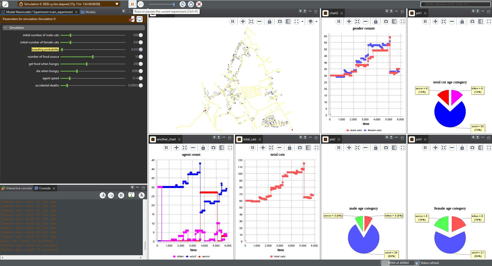
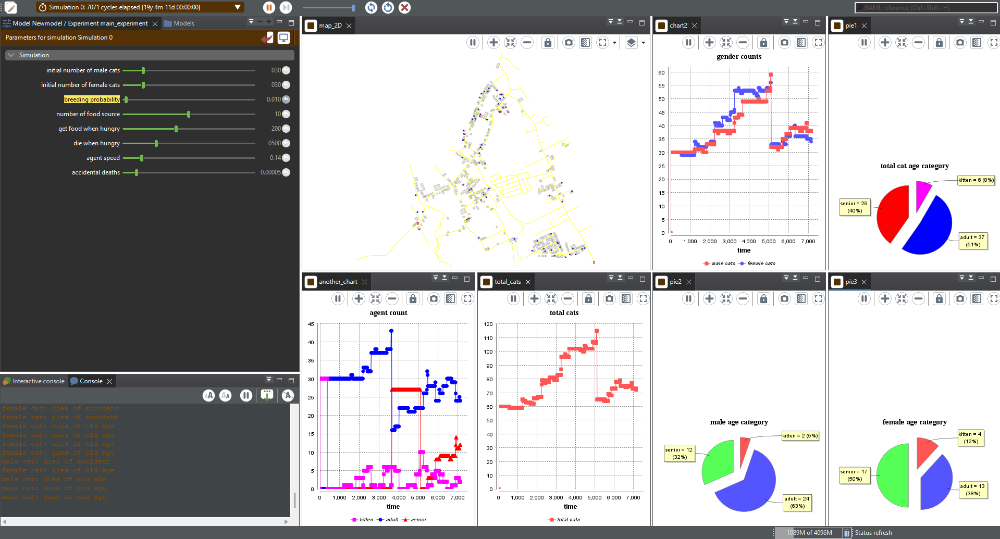
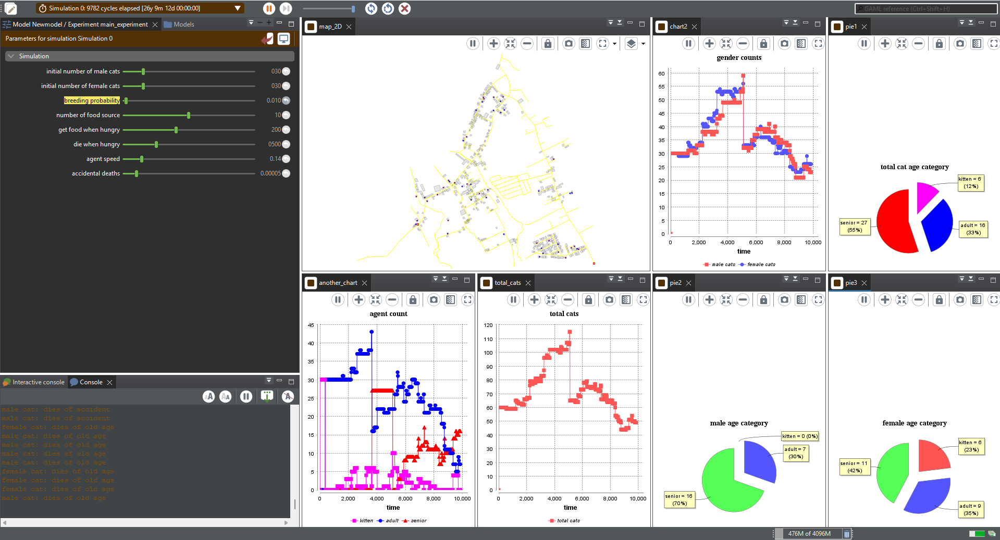

# Feline-Simulation-GAMA-Env
An academic project simulation using GAMA platform. Agent-based simulation of stray cat reproduction rates.

How to make it work:
1. Install GAMA platform
2. Import the model to GAMA
3. Insert "road.shp" and "buildings.shp" into the code
4. Adjust variables if needed
5. Run

Example Outputs Images:

## 15 years

## 19 years

## 26 years
